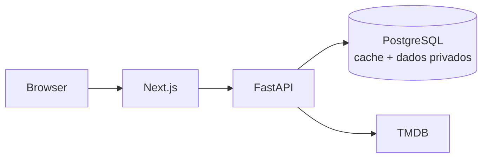

<p align="center">
  
</p>

<h1 align="center">Matinê</h1>

<p align="center">
  <strong>Descubra filmes. Encontre onde assistir. Preserve a sua privacidade.</strong>
</p>

<p align="center">
  <a href="https://github.com/blasther12/matine/actions/workflows/ci.yml"></a>
  <a href="https://github.com/blasther12/matine/actions/workflows/release.yml"></a>
  
  
  
</p>

Matinê é uma plataforma cinematográfica pessoal e social construída de forma
incremental, com privacidade por padrão. A entrega atual oferece catálogo
público do TMDB, identidade Supabase e biblioteca pessoal com autorização
deny-by-default.

> [!IMPORTANT]
> A busca não é persistida nem registrada. A Fase 3 guarda apenas o estado que
> o usuário escolheu para cada filme; e-mail e senha permanecem exclusivamente
> no Supabase Auth, e a biblioteca é privada por padrão.

## Por que Matinê?

| Experiência | Privacidade | Engenharia |
| --- | --- | --- |
| Busca, detalhes, elenco, trailers e provedores BR | Sem analytics, fingerprinting ou cookies de terceiros | Next.js, FastAPI, PostgreSQL e contratos explícitos |
| Interface em português e estados completos de UI | Segredos exclusivamente server-side | Testes, auditorias, CI e containers não-root |
| Evolução planejada para diário, listas e círculos | Coleta adiada até existir autorização e RLS | Releases SemVer e imagens OCI com SBOM/proveniência |

## Estado do produto

- [x] **Fase 0 — Foundation:** monorepo, FastAPI, Next.js, PostgreSQL, Alembic,
  Docker, testes, CI e baseline de segurança.
- [x] **Fase 1 — TMDB:** busca, detalhes, créditos, trailers e disponibilidade
  no Brasil, com cache somente de metadados públicos.
- [x] **Fase 2 — Identidade:** Supabase Auth SSR, `/me`, autorização no backend,
  perfil mínimo e RLS deny-by-default.
- [x] **Fase 3 — Biblioteca pessoal:** quero assistir, assistidos, abandonados,
  notas de 0,5 a 5 e favoritos, com propriedade derivada do token e RLS.
- [ ] **Fases seguintes:** diário, reviews, listas,
  círculos e Movie Night.

## Arquitetura



O navegador nunca recebe o token TMDB, credenciais do banco ou a futura chave
Supabase Service Role. O backend normaliza o conteúdo externo e expõe somente
schemas públicos explícitos.

```text
apps/web        Next.js App Router + TypeScript + Tailwind
apps/api        FastAPI + SQLAlchemy 2 + Alembic
packages/shared contratos gerados quando houver duplicação real
docs            arquitetura, segurança, dados, API e threat model
```

## Comece em minutos

### Pré-requisitos

- Python 3.12+
- Node.js 20.9+
- pnpm 11
- Docker com Compose, ou PostgreSQL local dedicado
- TMDB API Read Access Token para as rotas de catálogo

### Docker

```bash
cp .env.example .env
# Preencha TMDB_API_KEY apenas no arquivo local.
docker compose up --build
```

| Serviço | URL |
| --- | --- |
| Web | http://localhost:3000 |
| API | http://localhost:8000 |
| Health | http://localhost:8000/health |

### Desenvolvimento nativo

Backend:

```bash
cd apps/api
python3 -m venv .venv
.venv/bin/python -m pip install -c requirements.lock -e ".[dev]"
.venv/bin/python -m alembic upgrade head
.venv/bin/python -m uvicorn app.main:app --reload
```

Frontend, em outro terminal:

```bash
pnpm install --frozen-lockfile
pnpm dev
```

## API disponível

| Método | Endpoint | Persistência |
| --- | --- | --- |
| `GET` | `/health` | nenhuma |
| `GET` | `/movies/search?q=&page=` | busca nunca persistida |
| `GET` | `/movies/{tmdb_id}` | cache público de 24h |
| `GET` | `/movies/{tmdb_id}/credits` | cache público de 7 dias |
| `GET` | `/movies/{tmdb_id}/providers` | cache público de 6h |
| `GET` | `/me` | perfil privado do token autenticado |
| `POST` | `/me` | cria o perfil privado; proprietário vem do token |
| `GET` | `/me/movies`, `/me/watchlist`, `/me/watched` | biblioteca privada do token |
| `GET` | `/me/movies/{tmdb_id}` | estado pessoal de um filme |
| `POST` | `/me/movies/{tmdb_id}` | inclui ou substitui estado pessoal |
| `PATCH` | `/me/movies/{tmdb_id}` | altera campos informados |
| `DELETE` | `/me/movies/{tmdb_id}` | remove da biblioteca privada |

## Qualidade e entrega

```bash
# Frontend
pnpm lint
pnpm typecheck
pnpm test
pnpm build
pnpm audit --audit-level high

# Backend, a partir de apps/api
python -m ruff check .
python -m ruff format --check .
python -m mypy app
python -m pytest
python -m bandit -q -r app
python -m pip_audit
```

| Automação | Responsabilidade |
| --- | --- |
| CI | testes, lint, tipos, build, migrações e auditorias |
| PR title | Conventional Commits para versionamento previsível |
| Release | release PR, SemVer, changelog, tag e GitHub Release |
| Publish images | API e web multi-arquitetura no GHCR |

Consulte [versionamento e entrega](docs/deployment.md) para permissões, tags e
operação manual.

## Segurança

- allowlists explícitas para CORS e hosts;
- CSP, HSTS em produção, proteção contra framing e `nosniff`;
- logs sem query, IP, corpos, cookies ou headers de autorização;
- erros públicos sanitizados e rate limit efêmero;
- dependências travadas e Actions de release fixadas por SHA;
- segredos nunca entram em build args, imagens, respostas ou variáveis públicas.

Encontrou uma vulnerabilidade? Não abra uma issue pública. Siga a
[política de segurança](SECURITY.md).

## Documentação

- [Arquitetura](docs/architecture.md)
- [API pública](docs/api.md)
- [Integração TMDB](docs/tmdb.md)
- [Desenvolvimento](docs/development.md)
- [Versionamento e entrega](docs/deployment.md)
- [Mapa de dados](docs/data-map.md)
- [Threat model](docs/threat-model.md)
- [Como contribuir](CONTRIBUTING.md)

## Atribuição

Este produto usa a API do TMDB, mas não é endossado nem certificado pelo TMDB.
Dados de disponibilidade são fornecidos pelo JustWatch por meio do TMDB e podem
não refletir mudanças instantaneamente.

<p align="center">
  Feito com cuidado para quem ama cinema e prefere continuar no controle dos próprios dados.
</p>
